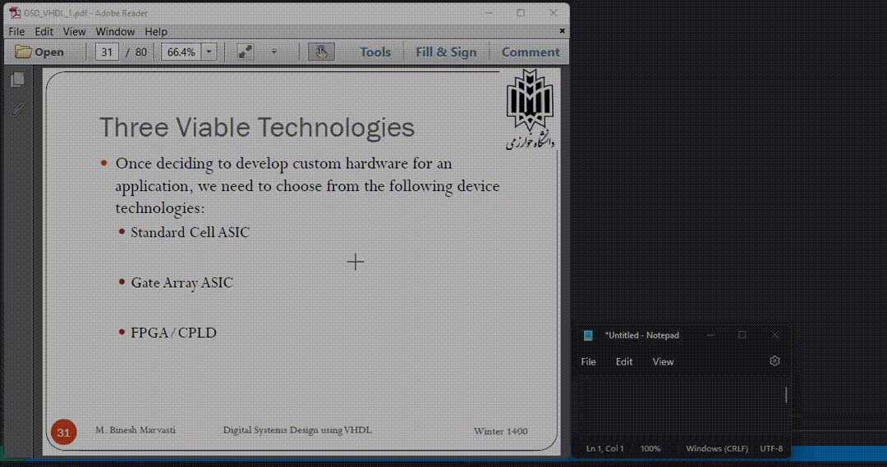

# Page Monitor
Hobby project that detects professor slide page number and writes it down in chatbox to make professor sure the slide are synced.

## Demo


## Train Font
Create training text, write allowed character (write multiple time the character that detect hardly)
```shell
$ echo "1 2 3 4 5 6 7 8 9 0 0 0" > training_text.txt
$ mkdir fonts
$ mkdir out
$ mkdir tmp_dir
```
Put your TFF file into the fonts folder, generate TIFF from the TFF file with the following command
```shell
$ text2image --fonts_dir="fonts" --text training_text.txt --find_fonts --fontconfig_tmpdir=tmp_dir --outputbase out/eng
```
Download [jTessBoxEditor](https://sourceforge.net/projects/vietocr/files/jTessBoxEditor/)
```shell
$ java -jar jTessBoxEditor.jar
```
Select the Training Data folder and choose Train from scratch, and press the Run button

## LICENSE
MIT